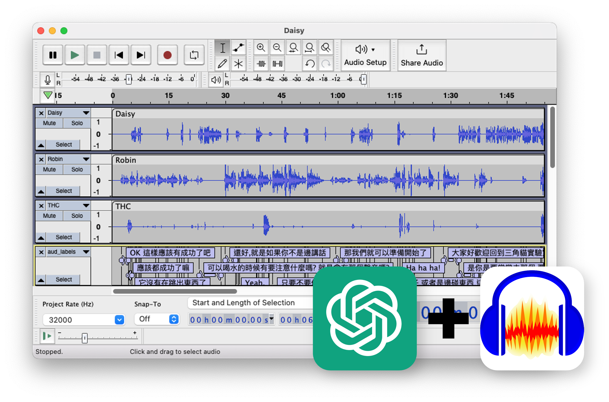

# Catshand (Cat's Hand)

Catshand (Cat's Hand) is a toolbox designed for audio editing and production in the team of Tripod Cat's Podcast. Catshand is named after the Japanese idiom "猫の手も借りたい", which means "so busy someone wants to borrow even the paw of a cat." It simplifies the audio editing process by automating repetitive tasks and integrating with the popular editing tool Audacity. Catshand provides OpenAI-powered transcription and content summary, so users can focus on the creative process, rather than spending time on content searching.  



## Installation

1. pull this git repository
2. move to the directory of catshand
3. create conda environment

    ```shell
    conda create -n catshand python=3.9
    ## catshand can be replaced by your-own-env-name
    ```

4. Change conda env 

    ```shell
    conda activate catshand
    ```

5. Install dependency
   
    ```shell
    pip install -r ./requirement_core.txt # for Mac User    
    pip install -r ./requirement_win.txt # for Windows User
    ```

6. Install ffmpeg
    
    ```shell
    conda install -c conda-forge ffmpeg -y
    ```

7. Installation

    ```shell
    pip install -e .
    ```

8. Download demo files from this [link](https://drive.google.com/drive/folders/18VaKpXfOgM0KQbxOm8sdr8dGdOJpBT3t?usp=share_link)

9. Add OpenAI API key to the environment variable to use the transcript generation function and transcript summary. Please visit [OpenAI](https://openai.com/) to get the API key and [Best Practices for API Key Safety](https://help.openai.com/en/articles/5112595-best-practices-for-api-key-safety) for more details.

    ```shell

    # Windows (in cmd prompt)
    setx OPENAI_API_KEY “<yourkey>”
    
    # Mac
    echo "export OPENAI_API_KEY='yourkey'" >> ~/.zshrc
    ```


## Audio Editing
Catshand divides editing steps into two parts: pre-edit and post-edit. Pre-edit is the preparation process of raw audio files so they are ready for manual editing to remove filler words or undesirable phrases. Post-edit is the process of editing the finalized audio files and applying compressors and music, to make them ready for publishing.

All functions of catshand are implemented in the command line. The following sections will provide an example to jumpstart the usage of catshand. Please visit the [manuals](./src/catshand/doc/manuals.md) for more details.

### Pre-edit
1. (Optional) Download audio materials from Google Drive: [link](https://drive.google.com/drive/folders/1vwkKg64AObKdqqiLxe1SyYdqx3ysGs3P?usp=share_link). This step is optional if you are using catshand only for pre-editing. Move the folder to the root directory of catshand.
2. Create a project folder in the root directory of catshand using the following command:
    ```shell
    catshand prjinit -d <root_dir> -n <project_name> -m <material_dir>
    # example
    catshand prjinit -d /path/to/project/Podcast/ -n EP099 -m /path/to/project/Podcast/material
    ```
    Answer the questions in the terminal. The project folder will be created in the root directory of catshand. The project folder will contain the following files:
3. Download audio files from Google Drive to the project folder. The folder name should be "00_Raw"
4. Run the following commands in order: 
    ```shell
    # conver m4a to wav with filename matching
    catshand audio2wav -p /path/to/project/Podcast/EP099 -m

    # launch audacity for manual audio alignment, editing and find splitting timepoint
    # transcript can be generated and load as labels
    # Answer the questions in the terminal
    catshand audacitypipe_prjpre -p /path/to/project/Podcast/EP099/ -t 4

    # perform loudness normalization and noise reduction
    catshand audio2wav -p /path/to/project/Podcast/EP099 -i /path/to/project/Podcast/EP099/00_Raw_wav_prjpre -lr -t 4
    
    # remove silence
    catshand silrm -p /path/to/project/Podcast/EP099/ -pz -t 4
    
    # split audio files
    catshand audiosplit -p /path/to/project/Podcast/EP099/ -ts 00:02:00 00:04:00 # split audio files
    ```
5. To split the file after track merging, you can run the following commands:
    ```shell
    # merge audio files into one track 
    # convert to stereo and spatial audio features
    # mergered audio exported to "merged" folder
    catshand trackmerger -p /path/to/project/Podcast/EP099/ -s -sp
    
    # split audio files
    catshand audiosplit -p /path/to/project/Podcast/EP099/ -i /path/to/project/Podcast/EP099/merged -ts 00:02:00 00:04:00 
    ```

### Post-edit
1. Run the following command for post-editing. Make sure the material folder is downloaded and placed in the dedicated folder.
    ```shell
    # convert wav and perform the loudness normalization
    catshand audio2wav -p /path/to/project/Podcast/EP099 -i /path/to/project/Podcast/EP099/03_Editing_02 -l -t 4
    
    # merge audio files from each sessions to a signle track
    catshand audmerger -p /path/to/project/Podcast/EP099 -i /path/to/project/Podcast/EP099/03_Editing_02_wav -t 4
    
    # convert highlight audio to wav with loudness normalization
    catshand audio2wav -p /path/to/project/Podcast/EP099 -i /path/to/project/Podcast/05_Highlight -l
    
    # Load to Audacity
    catshand audacitypipe -p /path/to/project/Podcast/EP099 -i /path/to/project/Podcast/EP099/03_Editing_02_wav_merged
    ```